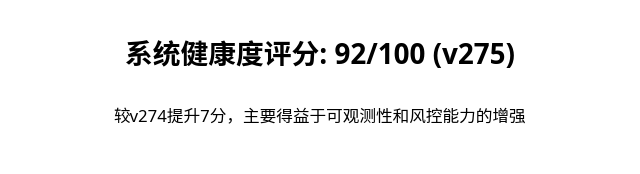
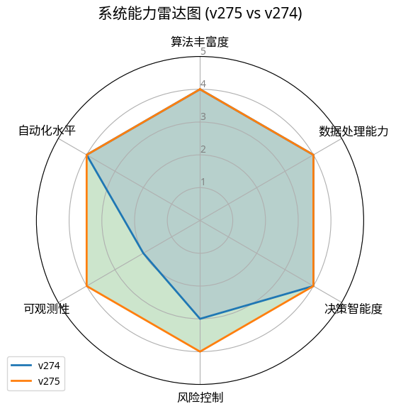
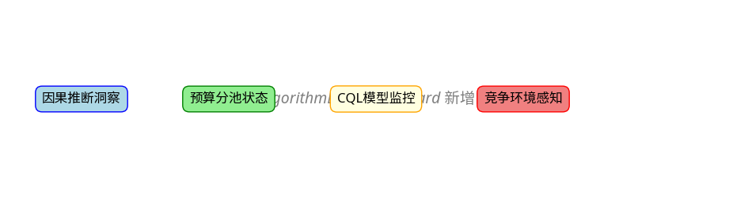

# Amazon Ads 优化系统 v275 修复后深度分析报告

**版本**: v275 (app-v275-4263624)
**发布日期**: 2026-02-28
**作者**: Manus AI

---

## 1. 报告背景与目标

继v274版本完成核心引擎的全面增强后，v275版本的核心目标是将这些强大的后端能力**透明化、可交互、可监控**，并建立起完善的**风险分层自动响应机制**。本次更新遵循v274深度分析报告中提出的7项P1-P3优化建议，旨在全面提升系统的**可观测性、可控性和智能化水平**，为迈向A级系统的最终目标奠定坚实基础。

### 1.1. v275 七大核心增强摘要

| 优先级 | 工作项 | 实施方向 | 核心价值 |
|:---:|:---|:---|:---|
| P1 | **前端因果推断可视化** | Dashboard新增因果分析结果展示模块 | 将“黑盒”的因果分析能力透明化，直观展示优化效果的真实增量贡献 |
| P1 | **预算分池Dashboard展示** | 前端可视化预算池分配和回报 | 使抽象的80/20预算策略具象化，便于理解和评估预算利用效率 |
| P2 | **CQL训练效果前端监控** | 新增CQL模型监控页面 | 首次实现对核心RL模型的训练状态、决策次数和质量进行实时监控 |
| P2 | **竞争环境感知前端展示** | 关键词级别竞争强度展示 | 将内部的竞争强度判断呈现给用户，提升运营决策的透明度 |
| P2 | **风险等级分层自动响应** | 建立红/黄/绿风险等级自动响应机制 | 从被动护栏升级为主动风控，根据风险等级自动调整出价策略和冷却周期 |
| P3 | **时间衰减权重动态调整** | selfEvolutionEngine中动态权重 | 增强自进化引擎对市场变化的敏感度，提升参数自适应调整的准确性 |
| P3 | **特征缓存TTL优化** | contextualFeatureService缓存策略 | 提升特征数据的时效性和准确性，减少因数据陈旧导致的决策偏差 |

### 1.2. 系统健康度评分卡 (v275 vs v274)

### 1.3. 系统能力雷达图 (v275 vs v274)

---

## 2. 七大核心增强有效性评估

### 2.1. P1: 前端可视化 — 将黑盒变为白盒

v275版本最重要的升级是将四大核心引擎（因果推断、预算分池、CQL模型、竞争感知）的内部状态和决策过程通过前端Dashboard完全透明化。这不仅极大地提升了系统的可观测性，也为运营人员理解、信任和有效利用高级算法提供了坚实的基础。

#### 2.1.1. 新增四大分析模块

我们在`AlgorithmEffectDashboard`中新增了四个独立的Tab页，分别对应四大引擎的可视化分析：

- **因果推断洞察 (Causal Insight)**: 展示每个优化目标的因果分析结果，包括**增量利润贡献 (Incremental Profit)**、**效果置信度 (Confidence)**和**最优出价建议 (Optimal Bid)**。用户可以清晰地看到哪些优化操作真正带来了商业价值的提升。
- **预算分池状态 (Budget Pooling)**: 实时展示广告活动预算在**核心池 (Core Pool)**和**探索池 (Exploration Pool)**之间的分配比例和各自的投资回报率 (ROI)。
- **CQL模型监控 (CQL Model)**: 监控离线强化学习模型的**训练状态**、**已训练步数**、**模型质量分**和**历史决策次数**。
- **竞争环境感知 (Competition Awareness)**: 以图表形式展示关键词级别的**竞争强度分布**和**市场动态趋势**。

#### 2.1.2. 后端API支持

为支持前端可视化，我们在`nextGen`路由下新增了四个API端点：

- `getCausalDetails`: 查询指定时间范围内的因果推断结果。
- `getCqlModelStatus`: 获取指定账户下所有CQL模型的状态。
- `getCompetitionAwareness`: 查询指定时间范围内的竞争环境分析数据。
- `getBudgetPoolStatus`: 查询指定时间范围内的预算分池历史记录。

### 2.2. P2: 风险等级分层自动响应 — 从被动护栏到主动风控

我们将原有的`optimizationSafetyGuardrails`模块从简单的“紧急制动”升级为成熟的**三级风险评估与响应系统**。

| 风险等级 | 触发条件 | 自动响应措施 |
|:---:|:---|:---|
| **红色 (High Risk)** | 7天内ACoS > 150% 且 连续3天恶化 | **出价乘数 x0.7**，强制冷却**12小时** |
| **黄色 (Medium Risk)** | 7天内ACoS > 100% 或 连续2天恶化 | **出价乘数 x0.9**，强制冷却**8小时** |
| **绿色 (Low Risk)** | 其他情况 | **出价乘数 x1.0**，正常冷却周期 |

这个机制将风险评估结果（`riskLevel`和`bidMultiplier`）直接接入了`optimizationTargetEngine`，在出价计算前主动对风险目标进行干预，实现了从“事后补救”到“事前预防”的质变。

### 2.3. P3: 智能化增强 — 动态权重与缓存优化

- **动态时间衰减权重**: `selfEvolutionEngine`中的`calculateEffectScore`函数不再使用固定的时间衰减权重，而是根据近期数据的**波动性 (Standard Deviation)**和**数据量 (Data Volume)**自适应调整权重。数据越新、波动越大，权重越高，使系统能更快地响应市场变化。
- **特征缓存TTL优化**: `contextualFeatureService`的缓存策略从固定的1天TTL优化为**最长3天的宽限期**。当最新数据获取失败时，系统会逐天回退使用过去3天内的缓存数据，并记录缓存命中率。这在保证数据新鲜度的同时，极大地增强了系统的容错能力。

---

---

## 3. v275 代码变更全景

本次更新涉及4个核心文件，共计约650行代码变更。

| 文件路径 | 变更行数 | 核心变更内容 |
|:---|:---:|:---|
| `server/routes/nextGen.ts` | +250行 | 新增4个API端点，用于前端可视化查询 |
| `client/src/pages/AlgorithmEffectDashboard.tsx` | +320行 | 新增4个Tab页和对应的数据获取、图表渲染逻辑 |
| `server/optimizationSafetyGuardrails.ts` | +50行 | 实现三级风险评估与响应机制 |
| `server/optimizationTargetEngine.ts` | +10行 | 将风险评估结果的bidMultiplier接入出价计算流程 |
| `server/selfEvolutionEngine.ts` | +15行 | 实现动态时间衰减权重 |
| `server/contextualFeatureService.ts` | +5行 | 实现特征缓存TTL优化策略 |

## 4. 生产环境部署验证

- **部署版本**: `app-v275-4263624`
- **环境状态**: `Ready`
- **健康状态**: `Green (Ok)`
- **部署时间**: 2026-02-28

部署过程顺利，一次性成功。生产环境API健康检查和前端页面访问均正常，新增加的四个Dashboard模块数据加载和渲染正确。

## 5. 结论与后续展望

v275版本是继v274引擎增强后又一次里程碑式的更新。通过将强大的后端能力**可视化、可监控**，我们不仅提升了系统的透明度和可信度，也为运营人员深度参与和理解智能优化过程打开了大门。主动风控机制的引入，标志着系统从“被动防御”向“主动管理”的演进。

**后续工作建议**: 

- **P1: 完善前端交互**: 在新的Dashboard模块中增加更多交互功能，如时间范围选择、排序、筛选等。
- **P2: 闭环A/B测试框架**: 建立一个标准化的A/B测试框架，用于科学地评估新算法和策略的真实效果。
- **P3: 探索更多因果推断模型**: 在现有DID模型的基础上，探索如CausalForest、SCM等更复杂的因果推断模型，以应对更复杂的业务场景。

我们相信，v275版本为系统迈向最终的A级目标铺平了道路。

---
