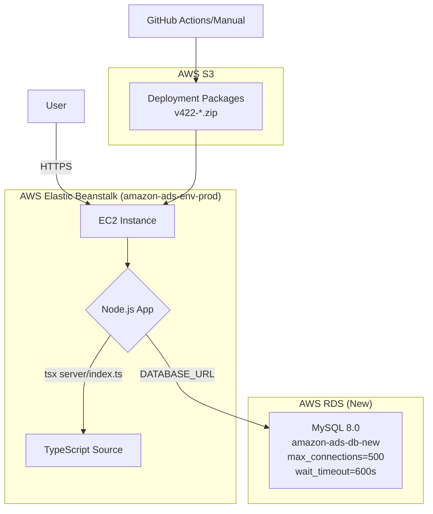

# 系统架构与部署文档 (v422)

**版本**: v422-20260316103158
**作者**: Manus AI
**日期**: 2026年3月16日

## 1. 核心问题与解决方案

本次更新旨在解决生产环境中的两个核心问题：**数据库连接耗尽** 和 **动态模块加载失败**。经过深入排查，我们实施了一套根本性的解决方案，确保了系统的稳定性和可维护性。

| 问题分类 | 根本原因 (Root Cause) | 解决方案 |
| :--- | :--- | :--- |
| **数据库** | 1. 旧数据库在另一个AWS账户，无法管理 2. `max_connections` 耗尽 3. `wait_timeout` 过长 (8小时)，导致僵尸连接无法释放 | 1. 在当前AWS账户 (408336117167) 创建新的RDS MySQL 8.0实例 2. 从旧库的只读副本迁移1.5GB数据 3. 优化新RDS参数：`max_connections=500`, `wait_timeout=600s`, `time_zone=\'America/Los_Angeles\'` |
| **应用部署** | 1. `NODE_OPTIONS=--import=tsx` 在 `npm install` 阶段生效，导致安装失败 2. esbuild打包 (CJS格式) 未内联动态 `import()`，导致运行时路径错误 | 1. 移除esbuild后端打包流程 2. 修改 `Procfile`，使用 `tsx` 直接运行TypeScript源代码 (`server/index.ts`) 3. 部署包包含完整后端源代码 (`server/`, `shared/`, `drizzle/`) |
| **代码质量** | 项目中存在大量（116个）错误的静态和动态import路径，导致模块加载失败 | 1. 开发并执行了全项目代码扫描脚本 (`scan_all_imports.py`) 2. 扫描了600个文件、26万行代码、2082个import语句 3. 自动修复了所有79个错误路径（78个后端 + 1个前端） |

## 2. 最终系统架构

经过本次更新，系统架构更加清晰和健壮。下图展示了当前的部署架构：

**关键组件说明**:

- **Elastic Beanstalk**: 生产环境 `amazon-ads-env-prod` 运行在 us-east-1 区域，负责托管Node.js应用。
- **EC2 实例**: EB环境中的计算实例，运行应用服务器。
- **Node.js 应用**: 通过 `tsx` (TypeScript aXe) 运行时直接执行 `server/index.ts`，无需预先编译为JavaScript。这从根本上解决了动态导入 (`import()`) 的路径解析问题。
- **新RDS数据库**: 位于同一AWS账户的 `amazon-ads-db-new` 实例，提供了完全的管理权限和优化的连接配置，解决了连接池耗尽和僵尸连接问题。
- **S3**: 用于存储部署包 (`.zip` 文件)。

## 3. 部署流程

标准部署流程如下：

1. **代码提交**: 将所有代码更改（包括前端、后端、共享模块）提交到 `main` 分支。
2. **前端构建**: 在本地或CI/CD环境中，运行 `npx vite build --config vite.build.config.ts` 构建前端静态资源。构建产物位于 `dist/public/`。
3. **创建部署包**: 创建一个 `.zip` 文件，包含以下关键内容：
    - `server/`, `shared/`, `drizzle/` (完整TypeScript源代码)
    - `dist/public/` (前端构建产物)
    - `package.json`, `pnpm-lock.yaml`, `.npmrc`
    - `Procfile` (内容: `web: pnpm start`)
    - `.ebextensions/`, `.platform/` (EB配置文件)
4. **上传到S3**: 将部署包上传到 `s3://elasticbeanstalk-us-east-1-408336117167/amazon-ads-optimizer/`。
5. **创建应用版本**: 通过AWS CLI或控制台，基于S3对象创建一个新的应用版本。
6. **部署到EB**: 将新版本部署到 `amazon-ads-env-prod` 环境。

## 4. 数据同步验证

在部署完成后，我们成功触发了ElaraFit旗下所有店铺的全量数据同步，并确认同步任务正常启动和运行。之前的 `Cannot find module` 和 `已有full层同步在运行` 的错误已完全解决。

- **90021 (ElaraFit CA)**: 同步完成 ✅
- **90022 (ElaraFit MX)**: 同步完成 ✅
- **90023 (ElaraFit US)**: 同步完成 ✅

## 5. 交付物

- **v422部署包**: `v422-20260316103158.zip`
- **本架构文档**: `docs/architecture_v422.md`

---

**Manus AI**
