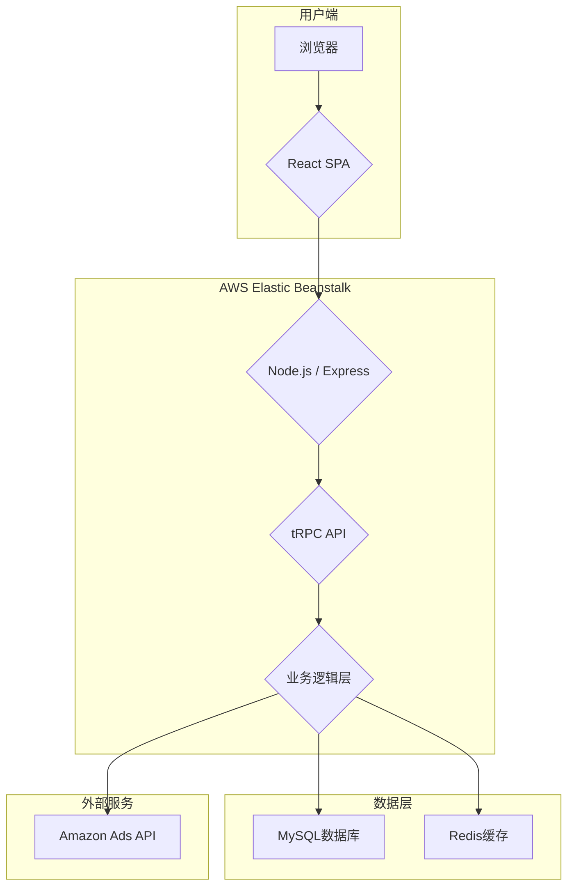

# 1. 系统架构

## 1.1 技术栈

| 分层 | 技术 | 描述 |
|---|---|---|
| **前端** | React, TypeScript, Vite, TailwindCSS, wouter | SPA单页应用，使用Vite构建，wouter作为轻量级路由 |
| **后端** | Node.js, TypeScript, Express, tRPC, Drizzle ORM | 使用Express作为HTTP服务器，tRPC提供类型安全的API，Drizzle作为ORM操作数据库 |
| **数据库** | MySQL, Redis | MySQL存储核心业务数据，Redis用于缓存和分布式锁（未来规划） |
| **构建/部署** | esbuild, pnpm, AWS Elastic Beanstalk | 使用esbuild打包后端代码，pnpm管理依赖，部署在EB Node.js环境 |

## 1.2 架构图

## 1.3 核心流程

1. **数据同步**: `unifiedSyncEngine.ts` 是核心同步引擎，通过分层(tier)调度机制，从Amazon Ads API拉取数据并存入MySQL。
2. **API服务**: `server/_core/trpc.ts` 初始化tRPC，`server/routers.ts` 组合所有子路由，对外提供类型安全的API。
3. **前端渲染**: React应用通过tRPC客户端调用API，获取数据并渲染页面。
4. **自动优化**: `adAutomation.ts` 和 `bidOptimizer.ts` 等模块负责执行自动化的广告优化策略。
